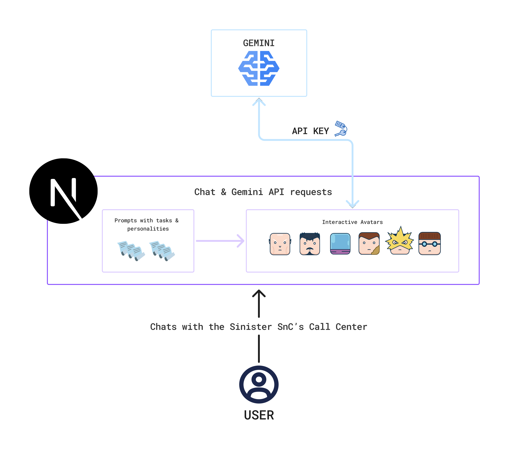

  

<h3 align="center">
  Do you want us to solve some of your problems?
</h3>

<h3 align="center">
  Don't worry, we got your back ... to stab it 🗡️
</h3>

<h4 align="center">
  Our team during the development:
</h4>

  

<h3 align="left">
  💡 The Idea
</h3>

  This project was born out of the <a href="https://www.tomorrowdevs.com/" target="_blank" rel="noopener noreferrer"><strong>Tomorrow Devs Summer Camp</strong></a> experience.
  It was created with the goal of learning how to build a full-fledged chatbot application from scratch, including deployment.

  The challenge was: <em>"Build a chatbot that simulates an endless phone hold, with multiple personalities, that is both entertaining and frustrating."</em>

  This is our take on that challenge.

<h3 align="left">
  🕹️ PlayGround Link
</h3>

  You can play with the app at the following <a href="https://sinister-six.vercel.app/" target="_blank">link.</a>

<h3 align="left">
  🏯 Architecture Overview
</h3>

This project was built with <strong>Next.js</strong>, giving us a solid base to develop the chatbot.
We crafted predefined prompts to bring distinct personalities to each avatar.
The avatars themselves are none other than the <strong>Sinister Six</strong> from the <strong>Spider-Man</strong> universe, ready to chat with you.

  If you want to dive deeper into the architecture, you can check out:

<ul>
  <li><a href="src/app/frontend-doc.md" target="_blank">Frontend documentation</a></li>
  <li><a href="src/app/gemini-interaction-doc.md" target="_blank">Gemini interaction documentation</a></li>
</ul>

<h3> ⚙️ &nbsp;How to run this project</h3>

<ol>
  <li>Clone the project;</li>
  <li>
    From the terminal, enter in the project:
    <ul>
      <li><code>cd chatbot_sinistri_sei</code></li>
    </ul>
  </li>
  <li>Create a .env file inside the root folder;</li>
  <li>Create a <code>GEMINI API KEY</code> with Google AI Studio;</li>
  <li>
    Put your key in the .env file as follows:
    <ul>
      <li><code>GOOGLE_GENERATIVE_AI_API_KEY=your_key</code></li>
    </ul>
  </li>
  <li>Install the dependencies as follows:
      <ul>
      <li><code>npm i --immutable</code></li>
    </ul>
  </li>
  <li>Run the project:
      <ul>
      <li><code>npm run dev</code></li>
    </ul>
  </li>
</ol>

  

